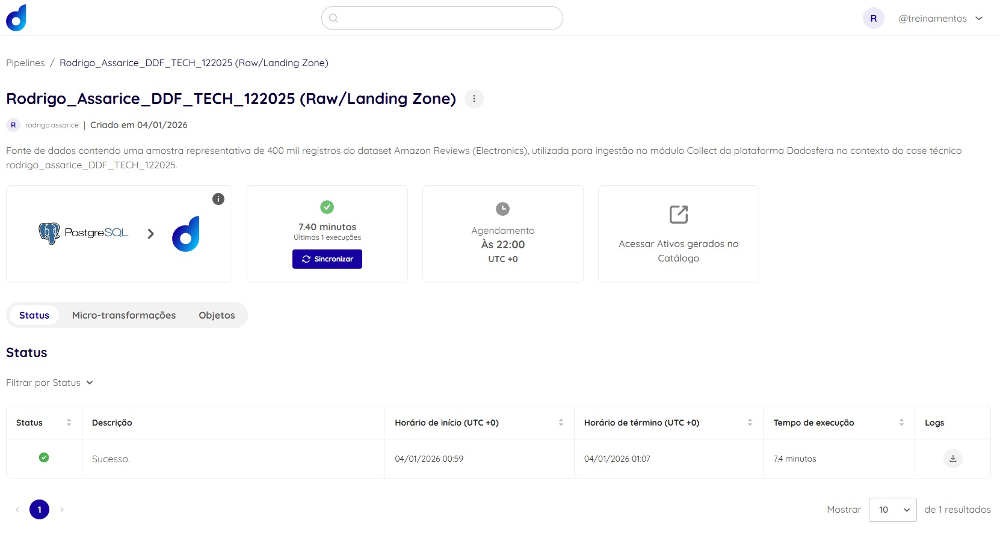
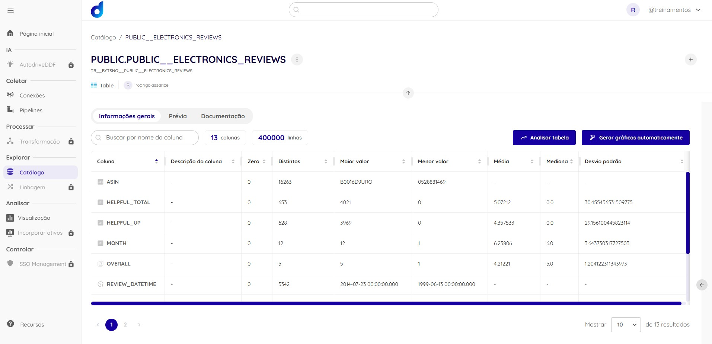
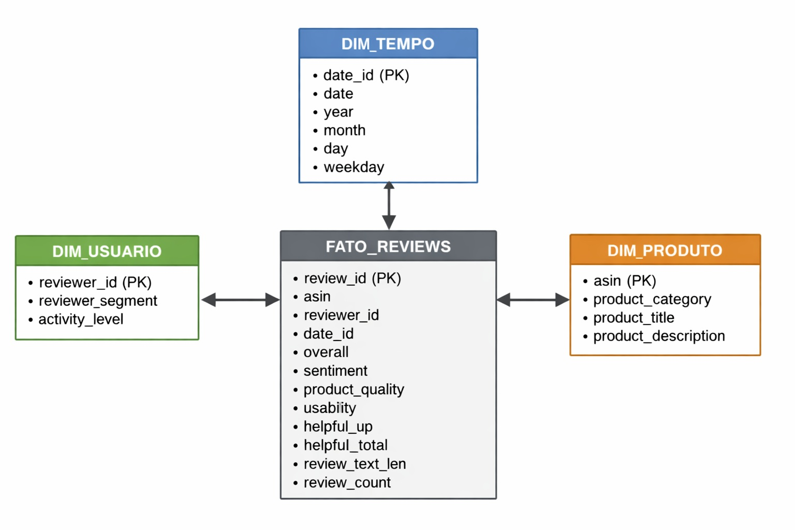

# Case Técnico Dadosfera - Rodrigo Assarice
**Cargo:** Engenheiro de Dados (Candidato)

## 📌 Visão Geral do Projeto
Este repositório contém a resolução do Case Técnico da Dadosfera, simulando uma operação completa de dados ponta a ponta para um ecossistema de e-commerce. O objetivo é demonstrar proficiência em ingestão, catalogação, qualidade, modelagem dimensional, IA Generativa e visualização.

---

## 🔗 Links rápidos – Ativos do projeto

### Pipelines
- **Amazon Reviews_DDF_TECH_122025_v2**  
  https://app.dadosfera.ai/pt-BR/collect/pipelines/ee124bd6-b4f2-47db-8a19-00739509e01e

### Dados Curados / DW
- **PUBLIC.DW__FATO_REVIEWS_ENRIQUECIDA**  
  https://app.dadosfera.ai/pt-BR/catalog/data-assets/f6033cf6-b16c-4df1-9f67-3872af98892a

### Catálogo de Dados
- **PUBLIC.PUBLIC__ELECTRONICS_REVIEWS**  
  *(TB__BYTSNO__PUBLIC__ELECTRONICS_REVIEWS)*  
  https://app.dadosfera.ai/pt-BR/catalog/data-assets/b6409229-a9e6-45ea-878c-911811e1e65c

### Visualizações / BI
- **Amazon Reviews (Dadosfera)**  
  https://app.dadosfera.ai/pt-BR/catalog/data-assets/aa7be233-88a9-4f5d-ad3b-9fba4dad77df
- **Amazon Reviews (Metabase)**  
  https://metabase-treinamentos.dadosfera.ai/dashboard/236-amazon-reviews
  
---

## 📝 Nota sobre a escolha do dataset

Para este case, foi utilizado o dataset de reviews da Amazon (Electronics) com o objetivo de demonstrar o uso de IA generativa e técnicas de enriquecimento semântico aplicadas a dados textuais não estruturados.

Em um cenário real de e-commerce, é comum que análises estratégicas envolvam também dados transacionais (pedidos, clientes, logística). No entanto, o pipeline, a modelagem e as análises desenvolvidas neste projeto são diretamente aplicáveis a bases transacionais, mantendo a mesma lógica arquitetural e analítica.

A escolha deste dataset permitiu explorar, de forma mais aprofundada, capacidades técnicas relacionadas a processamento de linguagem natural, geração de features e integração de IA generativa, atendendo aos objetivos propostos no case.

---

### 📊 Cronograma Detalhado (Gantt)

| Atividade | Hr 1 | Hr 2 | Hr 5 | Hr 8 | Hr10 | Hr11 | Status |
| :--- | :---: | :---: | :---: | :---: | :---: | :---: | :--- |
| **0 e 1: Fundação e Base de Dados** | 🟦 | | | | | | ✅ |
| **2.1 e 3: Ingestão e Catalogação** | | 🟦 | | | | | ✅ |
| **4 e 5: Qualidade e GenAI** | | | 🟦 | | | | ✅ |
| **6 e 7: Modelagem e Pipelines** | | | | 🟦 | | | ✅ |
| **8: Pipelines com spark** | | | | 🟦 | | | 📅 |
| **7 e 9: BI e Data App (Streamlit)** | | | | | 🟦 | | ✅ |
| **10: Entrega e Vídeo** | | | | | | 🟦 | 📅 |

*Legenda: 🟦 Período de execução | ✅ Concluído | 🕒 Em Progresso | 📅 Agendado*

## 📅 Item 0: Planejamento (Horas)

### Cronograma de Execução

| Dia | Fase | Atividade Principal | Itens Relacionados |
| :--- | :--- | :--- | :--- |
| **Hr 1** | **Ingestão** | Setup, Escolha do Dataset e Carga inicial | Item 1, 2.1 |
| **Hr 2** | **Catálogo** | Criação do Dicionário de Dados e Exploração | Item2.1, Item 3 |
| **Hr 5** | **Qualidade** | Relatórios de Data Quality (Great Expectations) | Item 4 |
| **Hr 6** | **Inteligência** | Processamento com GenAI e LLMs | Item 5 |
| **Hr 8** | **Arquitetura** | Modelagem Star Schema e Dashboards | Item 6, 7 |
| **Hr 10** | **Entrega** | Finalização BI, Data App Streamlit  | Item 9|

### Quadro Kanban do Projeto

| A FAZER (Backlog) | EM ANDAMENTO | CONCLUÍDO |
| :--- | :--- | :--- |
| Item 10: Pitch Final (Vídeo) | Item 8: Pipeline de Dados | Item 0: Planejamento ✅ |
|  | | Item 2.1: Ingestão na Dadosfera ✅ |
|  | |Item 3: Catálogo de Dados ✅ |
|  | |Item 4: Data Quality ✅ |
|  | |Item 5: GenAI & LLM ✅ |
|  | |Item 6: Modelagem Star Schema ✅ |
|  | |Item 7: Dashboard de BI ✅ |
|  | |Item 9: Data App (Streamlit) ✅ |


---

## 📊 Detalhamento dos Itens do Case

### Item 1: Base de Dados Selecionada
## 📦 Dataset Escolhido — Amazon Reviews (Electronics)

- **Fonte:** Stanford SNAP – Amazon Product Reviews  
- **Domínio:** E-commerce  
- **Volume:** ~400.000 registros  
- **Granularidade:** 1 linha por review  

Principais campos:
- `reviewerID` — identificador do usuário  
- `asin` — identificador do produto  
- `overall` — avaliação (1 a 5)  
- `reviewText` — texto da avaliação  
- `review_datetime` — data da review  
- `year`, `month` — atributos temporais  

A preparação inicial do dataset foi realizada em ambiente externo, utilizando **Google Colab** e **Python**, com o objetivo de validar volume, estrutura e qualidade dos dados antes da ingestão definitiva na plataforma Dadosfera.

### Notebook utilizado
- `notebooks/Colab_Item1_AmazonDataset.ipynb`

### Principais atividades
- Download do dataset bruto (`.json.gz`)
- Leitura incremental controlada por volume
- Seleção e tipagem das colunas relevantes
- Geração de arquivos no formato **Parquet**
- Validação de volume mínimo (>100.000 registros)

Saída principal:
- `electronics_reviews_prepared.parquet`


## 🔗 Item 2 — Sobre a Dadosfera: Integrar (Collect)

Após a preparação dos dados, o dataset foi persistido em uma **fonte estruturada PostgreSQL (Neon)**, utilizada como **sistema fonte externo** para a plataforma Dadosfera.

### Processo de integração
- Criação de uma conexão PostgreSQL no módulo **Collect**
- Configuração de carga **Full Load**
- Execução da pipeline de ingestão
- Validação da carga com sucesso

📸 **Pipeline de Coleta – Collect**  

A imagem faz referencia a pipeline de dados realizada.

## 🔍 Item 3 — Sobre a Dadosfera: Explorar e Catalogar

Os dados ingeridos foram posicionados na **Landing Zone**, camada de ingestão (*Raw*) da arquitetura de Data Lake da Dadosfera.

Após a ingestão, o dataset foi automaticamente disponibilizado no módulo **Explorar (Catálogo)**, onde foram registrados metadados relevantes, seguindo boas práticas de **Dicionário de Dados**.

📸 **Dataset Catalogado na Dadosfera**  

A imagem acima representa o catalogo de dados referenciado na plataforma.


Além disso, foi utilizado o notebook:
- `notebooks/Governanca_Amazon_Reviews.ipynb`

## 🧪 Item 4 — Qualidade dos Dados
Com o objetivo de avaliar a qualidade do dataset Amazon Reviews (Electronics) ingerido na plataforma Dadosfera, foram realizadas verificações de Data Quality com foco exploratório, seguindo boas práticas adotadas em pipelines de Engenharia de Dados.

As análises tiveram como finalidade garantir que os dados estivessem aptos para consumo analítico, além de documentar possíveis inconsistências antes de etapas futuras de processamento.

## 🔍 Dimensões de Qualidade Avaliadas

As seguintes dimensões de qualidade foram consideradas:
Completude: verificação da presença de valores nulos nas colunas do dataset.
Validade: checagem da conformidade dos dados em relação a domínios esperados.
Consistência: avaliação da coerência entre colunas relacionadas.
Conformidade: aderência ao schema inferido durante a ingestão.

## 🛠️ Metodologia Utilizada

As verificações foram executadas por meio de um notebook exploratório, utilizando:
Great Expectations (API Pandas legacy) para regras de completude e validade.
Regras customizadas em pandas para validações específicas de consistência entre colunas.
O notebook utilizado encontra-se em:
notebooks/DataQuality_Amazon_Reviews_Soda_GE.ipynb

## ✅ Regras de Qualidade Implementadas

Completude
Verificação da ausência de valores nulos em colunas obrigatórias como asin e reviewerID.
Validade
overall com valores entre 1 e 5.
month com valores entre 1 e 12.
year dentro de um intervalo temporal válido.
Consistência
Regra garantindo que helpful_up seja sempre menor ou igual a helpful_total, validada por meio de uma checagem customizada em pandas.

## 📊 Resultados Obtidos

As validações não indicaram falhas críticas de qualidade:
O dataset apresentou alta completude, sem valores nulos.
Os campos numéricos respeitaram os domínios definidos.
Não foram encontradas violações na regra de consistência entre helpful_up e helpful_total.
As evidências geradas foram exportadas nos seguintes formatos:
data_quality_report.csv — relatório consolidado das validações.
ge_validation_results.json — resultado detalhado das execuções do Great Expectations.
Esses arquivos permitem rastreabilidade e reprodutibilidade das análises realizadas.

As verificações de qualidade indicam que o dataset está adequado para uso analítico e para etapas posteriores do ciclo de dados na plataforma Dadosfera.
Em um cenário produtivo, essas regras poderiam ser automatizadas por meio de pipelines no módulo de Inteligência da Dadosfera, possibilitando monitoramento contínuo e alertas em caso de desvios.

## 🤖 Item 5 — Uso de LLMs e Explicação do Prompt

Objetivo do uso de LLMs
O objetivo desta etapa foi demonstrar a capacidade de transformar dados textuais desestruturados em features estruturadas, utilizando modelos de linguagem (LLMs), possibilitando análises qualitativas e agregações analíticas que não seriam viáveis apenas com dados numéricos.
Foram utilizados textos de reviews de produtos, que representam dados não estruturados, extraídos do dataset.

Desenho da Solução com LLM
O processo foi implementado em um notebook exploratório, executado localmente, seguindo as seguintes etapas:

1 - Seleção de uma amostra representativa de reviews do dataset.
2 - Construção de um prompt estruturado, orientado à extração de informações específicas.
3 - Envio do texto ao modelo de linguagem (LLM) via API.
4 - Recebimento da resposta em formato JSON estruturado.
5 - Organização das features extraídas em um dataset analítico.

Essa abordagem permite validar o potencial do uso de LLMs para enriquecimento semântico dos dados, sem necessidade de processamento em larga escala.

Construção e Explicação do Prompt

O prompt foi desenhado de forma determinística e orientada à tarefa, com o objetivo de reduzir ambiguidades e garantir consistência nas respostas.

You are a data extraction assistant.

Extract structured features in STRICT JSON with the following fields:
- sentiment (positive, neutral, negative)
- main_topics (array of strings)
- product_quality (good, average, poor)
- usability (easy, medium, hard)
- short_summary (one concise sentence)

Text:
"{review_text}"

Justificativa do Prompt

Contexto claro: o modelo é instruído a atuar como um assistente de extração de dados.
Formato de saída explícito: a exigência de JSON garante que a resposta seja diretamente consumível por pipelines analíticos.
Campos bem definidos:
sentiment: captura a polaridade emocional do texto.
main_topics: identifica os principais aspectos mencionados.
product_quality: infere a percepção de qualidade do produto.
usability: avalia a facilidade de uso percebida.
short_summary: gera um resumo semântico conciso.
Essa definição permite transformar texto livre em features padronizadas e reutilizáveis.

Execução do Modelo de Linguagem

Foi utilizado um modelo de linguagem da OpenAI (GPT) por meio de chamadas via API, com retorno forçado em formato JSON, garantindo consistência e facilidade de parsing.
Para fins de controle de custo e tempo de execução, o processamento foi realizado sobre uma amostra de 25 reviews, sendo suficiente para demonstrar o funcionamento da abordagem.

## Resultado da Geração de Features

A saída do modelo consiste em um conjunto de atributos estruturados, por exemplo:
{
  "sentiment": "positive",
  "main_topics": ["MMO gaming", "user experience"],
  "product_quality": "good",
  "usability": "easy",
  "short_summary": "The product enhances the gaming experience for MMO players."
}
Essas features podem ser utilizadas em análises agregadas, dashboards, modelos analíticos ou enriquecimento de dados em pipelines futuros.

O uso de LLMs demonstrado neste item evidencia como dados desestruturados podem ser convertidos em informação estruturada de alto valor analítico.
Em um ambiente produtivo, esse processo poderia ser automatizado e integrado a pipelines de processamento contínuo, respeitando requisitos de custo, governança e escalabilidade.

### 🧱 Item 6 — Modelagem de Dados

## Abordagem: Modelo Dimensional (Kimball)

Foi adotado o modelo dimensional de Kimball devido aos seguintes fatores:
 - O dataset possui natureza analítica e histórica.
 - O principal objetivo é análise de avaliações, produtos e comportamento de usuários.
 - A plataforma é orientada a consumo analítico, dashboards e relatórios.
 - O modelo dimensional oferece:
   - simplicidade de entendimento;
   - alto desempenho para consultas;
   - fácil integração com ferramentas de BI.

👉 Abordagens como Data Vault seriam mais adequadas a cenários de múltiplas fontes operacionais e alta complexidade, o que não é o caso deste dataset.

Uma linha da tabela fato representa uma review de um produto feita por um usuário em uma data específica.
Garantir:
    - consistência;
    - possibilidade de agregações temporais;
    - análise por produto, usuário e sentimento.

## 📐 Estrutura do Data Warehouse Proposto
   # 🔹 Tabela Fato
    FATO_REVIEWS
    Campo	        Descrição
    review_id	    Identificador da review
    asin	        Identificador do produto
    reviewer_id	    Identificador do usuário
    date_id	        Chave da dimensão tempo
    overall	        Nota numérica da review
    sentiment	    Sentimento extraído via LLM
    product_quality	Qualidade inferida
    usability	    Facilidade de uso
    helpful_up	    Votos positivos
    helpful_total	Total de votos
    review_text_len	Tamanho do texto
    review_count	Métrica derivada (1)

   # 🔹 Dimensões
    DIM_PRODUTO
    Campo	            Descrição
    asin	            Chave do produto
    product_category	Categoria do produto
    product_title	    Título
    product_description	Descrição

    DIM_USUARIO
    Campo	            Descrição
    reviewer_id	        Identificador do usuário
    reviewer_segment	Segmentação derivada
    activity_level	    Nível de atividade

    DIM_TEMPO
    Campo	Descrição
    date_id	Chave da data
    date	Data completa
    year	Ano
    month	Mês
    day	    Dia
    weekday	Dia da semana

## Visão 1 — Performance de Produtos
    Objetivo: analisar a percepção dos produtos ao longo do tempo.
    Exemplo de métricas:
        - média de avaliação (overall);
        - distribuição de sentimentos;
        - volume de reviews por produto;
        - engajamento (helpful_up).
    Consumo típico:
        - dashboards executivos
        - ranking de produtos

## Visão 2 — Comportamento dos Usuários
    Objetivo: entender padrões de usuários e engajamento.
    Exemplo de métricas:
        - número de reviews por usuário;
        - média de avaliações dadas;
        - padrão de sentimentos;
        - usuários mais ativos.
    Consumo típico:
        - análises de comportamento
        - segmentação de usuários

## Camadas do DW 
    A modelagem proposta se encaixa naturalmente nas camadas finais do Data Lake / DW:
        - Landing Zone: dados brutos ingeridos.
        - Standardized Zone: dados tipados e normalizados.
        - Curated Zone: modelo dimensional (fato + dimensões).
        - Consumption Layer: visões analíticas e dashboards.

## Modelo Dimensional (Star Schema)

A imagem acima representa o modelo dimensional proposto, seguindo o padrão Star Schema, com a tabela fato de reviews no centro e suas dimensões associadas.


### 📊 Item 7 — Análise de Dados: Dashboard e Consultas no Metabase
Objetivo da Análise

O objetivo dessa análise foi criar um dashboard interativo utilizando o Metabase, com base no dataset Amazon Reviews (Electronics). As análises focaram em métricas de avaliação, votos úteis, tamanho das avaliações e comportamento dos usuários. Essas métricas são cruciais para entender como os usuários interagem com os produtos e como as avaliações evoluem ao longo do tempo.

Processo no Metabase
Seleção de Dados:
Utilizando a tabela dw.fato_reviews_enriquecida e a tabela dw.dw_dim_tempo que contém informações sobre as avaliações dos produtos que os usuários realizaram, e informações adicionais como votos úteis, alem das datas da dimensão tempo.

Consultas e Visualizações Criadas:
As consultas SQL foram feitas para gerar métricas como:
Distribuição das Avaliações (Overall)por cliente: Analisando como as avaliações dos produtos são distribuídas ao longo das notas de 1 a 5.
Impacto das avaliações com base no descritivo dos reviews.
Engajamento dos Usuários (Helpful Up/Total): Mostrando a quantidade de votos úteis recebidos para cada produto.
Análise Temporal: Visualizando a evolução das avaliações ao longo do tempo, por ano e mês.
Tamanho das Avaliações: Analisando a média e a mediana do tamanho das avaliações de acordo com o tempo e a qualidade do produto.
Mediana do review agrupando por ano.

Nesta entrega, a etapa de enriquecimento via LLM foi demonstrada por amostragem (25 reviews) para validar o desenho da solução e o schema de features, considerando restrições de custo/tempo. Em cenário produtivo, a estratégia seria escalonar via batch assíncrono e/ou processamento incremental com controle de custos e monitoramento.

Gráficos e Resultados:
No Metabase, criei gráficos de:
Distribuição de Votos (Gráfico de barras).
Votos Úteis ao Longo do Tempo (Gráfico de linha).
Média de Tamanho de Avaliação (Gráfico de barras com linha).
Comparação de Qualidade do Produto e Tamanho da Avaliação.
Análise de Avaliações por Produto (Gráfico de barras).


A imagem faz referencia a visualização de dados geradas no meta.

### Consultas SQL (exemplos)
```sql
SELECT  date_trunc('month', date_id) AS mes,
        COUNT(*) AS total_reviews,
        AVG(overall) AS media_rating
FROM dw.fato_reviews_enriquecida
GROUP BY 1
ORDER BY 1;

SELECT sentiment,
       COUNT(*) AS qtd
FROM dw.fato_reviews_enriquecida
WHERE sentiment IS NOT NULL
GROUP BY sentiment
ORDER BY qtd DESC;

SELECT product_id,
       COUNT(*) AS qtd_reviews,
       AVG(overall) AS avg_rating
FROM dw.fato_reviews_enriquecida
GROUP BY product_id
ORDER BY qtd_reviews DESC
LIMIT 10;


SELECT date_trunc('month', date_id) AS mes,
       AVG(overall) AS media_rating
FROM dw.fato_reviews_enriquecida
GROUP BY mes
ORDER BY mes;

SELECT reviewtext_len,
       overall
FROM dw.fato_reviews_enriquecida
WHERE reviewtext_len IS NOT NULL AND overall IS NOT NULL;
```

### 8. Processamento de Dados com PySpark para Neon PostgreSQL (escopo demonstrativo)

No Item 8 do case, o objetivo era criar um pipeline de dados para processar as avaliações de produtos da Amazon e integrá-las com o Neon PostgreSQL. Implementar o PySpark para realizar o processamento dos dados e a  pipeline de extração, transformação e carga (ETL).

- `notebooks/PySpark_to_Neon_Integration.ipynb`

### Item 9 Sobre Data Apps
Similaridade entre Produtos: Utiliza o TF-IDF e cosine similarity para identificar produtos similares com base nas descrições das avaliações.
Análise Exploratória de Dados (EDA): Realiza uma análise descritiva dos dados, incluindo gráficos de distribuição de avaliações, comprimento das avaliações e matriz de correlação.
Visualizações Interativas: O app gera gráficos interativos utilizando Seaborn e Matplotlib, permitindo uma exploração visual detalhada dos dados.

Tecnologias Utilizadas
Streamlit: Framework para criar aplicações web interativas e visualizações de dados.
pandas: Manipulação de dados tabulares.
sklearn: Cálculo de similaridade entre produtos.
Seaborn e Matplotlib: Criação de gráficos e visualizações.

## ▶️ Como executar o Data App (Streamlit)

Pré-requisitos:
- Python 3.9+
- Ambiente virtual (opcional)

Passos:
pip install -r requirements.txt
streamlit run data_apps/app.py
Observação:
O app utiliza dados previamente processados e tem caráter demonstrativo para o case técnico.


---

## 🛠️ Tecnologias Utilizadas
- **Linguagens:** SQL e Python
- **IA:** OpenAI API / GenAI
- **Frameworks:** Streamlit, Great Expectations

## 📁 Estrutura do Repositório
```
DDF_TECH_122025/
├── README.md
├── pipeline_Dados.jpg
├── pv_catalogo.jpg
├── governanca_.jpg
├── modelagem.jpg
├── notebooks/
│   ├── Colab_Item1_AmazonDataset.ipynb
│   ├── Upload_Parquet_to_Neon_Postgres.ipynb
│   ├── Governanca_Amazon_Reviews.ipynb
|   ├── DataQuality_Amazon_Reviews_Soda_GE.ipynb
|   └── Item5_GenAI_Feature_Engineering.ipynb
├── data_apps/
|   └── app.py
├── governanca/
|   ├── data_quality_report.csv
|   ├── dicionario_dados.csv
|   ├── ge_validation_results.json
|   └── governanca_relatorio.md
```

---

## ✅ Status do Case

- ✔ Item 1 — Base de Dados  
- ✔ Item 2 — Integração (Collect)  
- ✔ Item 3 — Sobre a Dadosfera: Explorar e Catalogar
- ✔ Item 4 — Qualidade dos Dados
- ✔ Item 5 — Uso de LLMs e Explicação do Prompt (Limitado pelo uso de tokens)
- ✔ Item 6 — Modelagem de Dados
- ✔ Item 7 — Análise de Dados: Dashboard e Consultas no Metabase
- ✔ Item 9 — Sobre Data Apps


